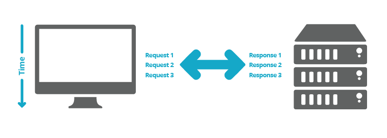

# HTTP2 WITH EXPRESS.js

## ***WHAT IS HTTP2***
HTTP is the foundation of the internet and the transferring of data from client to server (and vice-versa). So when you enter a URL in your browser, the browser sends the request to the web server via HTTP, and the server delivers the information through the same method. It sort of acts like the delivery van for information across the internet.

HTTP/2 is the modernised version of HTTP. Whereas HTTP was developed to handle the small websites and low traffic levels around the time of its inception (last modified in 1999!), the internet has developed massively since then and therefore needs a new method of handling all these requests for information.

#refrence: https://www.searchlaboratory.com/2016/01/how-http2-works-and-the-potential-benefits-for-seo/

----

## Sample express router

test project with going to page below

    curl http://localhost:3050/ping

the result is somthing like this:

    {
      status: 'active',
      framework: 'express.js',
      http_protocol: 'http2'
    }

## Create Pair Keys

The best offer for developer to reduce the operation time is create self sign CERTIFICAT for test. for better understand this context review article about self-sign in [let's encrypt](https://letsencrypt.org/docs/certificates-for-localhost/)

    openssl req -x509 -out localhost.crt -keyout localhost.key \-newkey rsa:2048 -nodes -sha256 \-subj '/CN=localhost' -extensions EXT -config <( \printf "[dn]\nCN=localhost\n[req]\ndistinguished_name = dn\n[EXT]\nsubjectAltName=DNS:localhost\nkeyUsage=digitalSignature\nextendedKeyUsage=serverAuth")